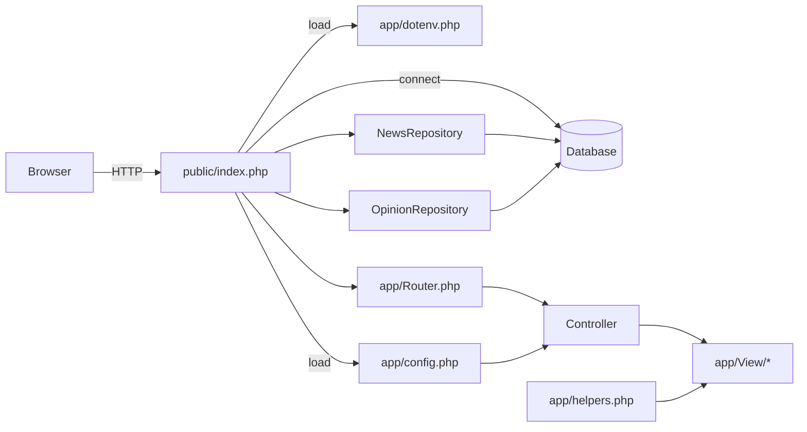

# Architecture

This project is a small MVC-style PHP application with a database-backed news pipeline. The main web entrypoint is `public/index.php`.

## Entry point

- `public/index.php` loads environment variables, loads `app/config.php`, creates a database connection, instantiates repositories, wires routes, and dispatches the request.
- `app/routes.php` defines the HTTP routes and ties them to controllers.

## Core components

- `app/Controller/*` handle request logic and pass view data.
- `app/Model/*` fetch data from the database and normalize it for rendering.
- `app/Service/*` contain cross-cutting services (database and RSS fetcher).
- `app/View/*` contains PHP templates and partials.
- `app/helpers.php` provides HTML escaping, formatting, and utility helpers used in views.

## Request flow (web)

## Repository normalization

`NewsRepository` attaches derived fields on each item:

- `category_label` and `category_slug` are resolved using curated categories, training mappings, aliases, and fuzzy matching.
- `source_name` is resolved using `news_sources`.
- `_published_ts` is used internally for sorting and removed before output.

`OpinionRepository` loads authors and articles, then attaches the author data to each article for rendering.
