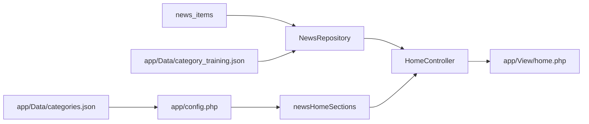

# Categories and Homepage

Categories are curated in JSON, normalized in `config.php`, and applied at runtime in `NewsRepository` and `HomeController`.

## Category sources

- `app/Data/categories.json` defines category groups and items.
- `app/Data/category_training.json` maps raw feed categories to curated slugs.

`app/config.php` reads these files and builds:

- `newsCategories` (flat list used for matching)
- `newsCategoryGroups` (grouped list used in navigation)
- `newsHomeSections` (home page section order)
- `newsCategorySubsections` and `newsCategoryParentMap` (subcategory filtering)

### categories.json structure

Each top-level group can include:

- `label`
- `items[]` with `slug`, `label`, optional `subtitle`
- optional `sub-categories` or `subcategories`
- optional `aliases` (used by matching)

The group keys that matter are `featured`, `sections`, `opinion`, and `otherCategories`. Inclusion in nav or home is controlled by `categoryGroupConfig` in `app/config.php`.

## Category normalization in NewsRepository

`NewsRepository` resolves categories per item using:

1) direct slug match
2) label match
3) training file mappings
4) aliases
5) fuzzy matching

If nothing matches, a fallback slug is generated from the raw category text.

## Homepage assembly

`HomeController` builds the home page from the full news list:

- `featured`: first 3 items
- `latest`: next 8 items
- `opinionLatest`: first 3 opinion articles from `OpinionRepository`
- `otherOpinions`: items where `category_slug` is `opiniao-outras-fontes` (up to 3)
- `sections`: uses `newsHomeSections` (from config) and falls back to `NewsRepository->categories()` if empty
  - per section: up to 6 items
  - first 2 items get a "feature" layout, the rest are compact cards

Note: The "featured" category group in `categories.json` is separate from the home page "featured" items. The former controls which curated categories appear on the homepage, while the latter is simply the top 3 news items by date.

## Dynamic categories on the news list

`NewsController` uses `NewsRepository->categories()` to build the category sidebar. It merges curated categories with dynamically observed categories from the current news items.
