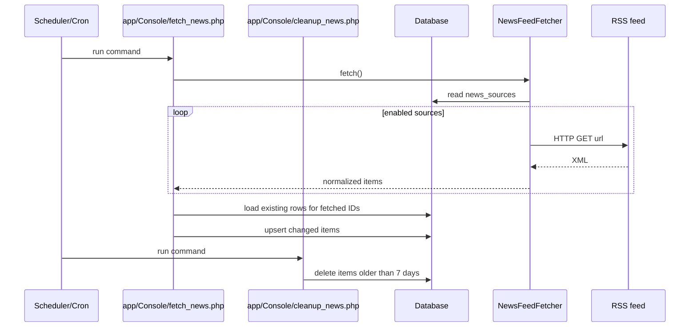

# Feed Flow

The news pipeline is database-first. Sources are defined in the `news_sources` table, and `fetch_news.php` pulls from those sources and upserts normalized items to `news_items`. A separate cleanup job removes items older than 7 days.

## Where sources are defined

- Primary source definition is in the database table `news_sources`.
- Each source has `id`, `name`, `type`, `url`, and an `enabled` flag.
- `app/Service/NewsFeedFetcher.php` reads sources via `readSourcesFromDb()`.

Sources should be managed directly in the `news_sources` table (or via your own tooling). The legacy JSON import script has been removed.

## Ingestion pipeline

## Normalization notes

`NewsFeedFetcher`:

- extracts title, link, summary, published date, author, and categories
- normalizes image URLs for some sources
- generates a stable `id` using `sha1(source_id|guid/link/title)`

`fetch_news.php`:

- filters to the last 7 days before writing
- preserves existing `fetched_at` values
- upserts only when items changed (diff check)

`cleanup_news.php`:

- deletes items older than 7 days (prefers `published_at`, falls back to `fetched_at`)
