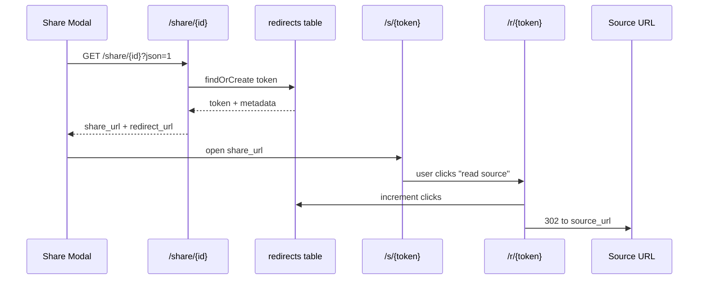

# Share Links and Redirects

Share links are database-backed and tracked in the `redirects` table.

## How it works

1) News cards include a "share" button with the `news_items.id`.
2) The share modal requests `/share/{id}?json=1`.
3) The server uses `RedirectRepository` to find or create a token.
4) The response includes a `share_url` and `redirect_url`.
5) `/s/{token}` renders a share landing page.
6) `/r/{token}` increments clicks and redirects to the original source URL.

## Files to know

- `app/routes.php` registers `/share`, `/s`, `/r` routes only when a DB connection exists.
- `app/Model/RedirectRepository.php` handles token creation and click tracking.
- `app/View/share_landing.php` renders the share preview page.
